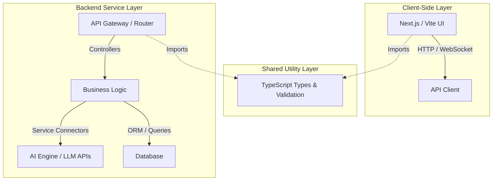

# 🏛️ System Architecture

This document describes the high-level architecture of **Genesis AI**.

---

## Overview

Genesis AI is structured as a fullstack monorepo featuring a separated Client and Server architecture linked by a Shared TypeScript/JSON schemas library.

---

## Core Components

### 1. Frontend Client (`/client`)
- **Framework**: Next.js (App Router) or Vite + React.
- **Styling**: Vanilla CSS / CSS Modules with variables for theme controls (Dark/Light mode).
- **State Management**: React Context or lightweight store (Zustand).

### 2. Backend Server (`/server`)
- **Runtime**: Node.js / TypeScript (Express or NestJS) or Python (FastAPI).
- **Orchestration**: Direct integration with LLM providers (OpenAI, Anthropic, Gemini).

### 3. Shared Library (`/shared`)
- **Zod Schemas**: Used for validation on both frontend forms and backend API payloads.
- **Interfaces / Types**: Centralized TypeScript declarations to ensure full-stack type safety.

### 4. Database & Storage (`/database`)
- **Relational**: PostgreSQL for structured data (Users, Conversations, Subscriptions).
- **Vector DB**: Pinecone, pgvector, or Qdrant for Retrieval-Augmented Generation (RAG).
