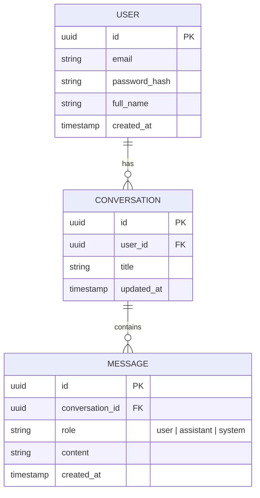

# 🗄️ Database & Schema Design

This document details the database schema and storage strategy for **Genesis AI**.

---

## Storage Paradigm

- **Primary Database**: PostgreSQL (for users, settings, and session metadata).
- **Vector Database**: PostgreSQL + pgvector (or Pinecone/Qdrant) for search and memory retrieval.

---

## Entity Relationship Diagram (Conceptual)

---

## Core Schemas

### `users`
Tracks user credentials, subscription tiers, and system profiles.

| Column | Type | Constraints | Description |
| :--- | :--- | :--- | :--- |
| `id` | UUID | PK, Default `uuid_generate_v4()` | Unique user identifier |
| `email` | VARCHAR(255) | Unique, NOT NULL | User log-in email |
| `password_hash`| VARCHAR(255) | NOT NULL | Hashed password |
| `created_at` | TIMESTAMP | DEFAULT NOW() | Account creation time |

### `conversations`
Maintains conversational groupings.

| Column | Type | Constraints | Description |
| :--- | :--- | :--- | :--- |
| `id` | UUID | PK | Conversation session identifier |
| `user_id` | UUID | FK -> `users.id`, Cascade | Owner of this conversation |
| `title` | VARCHAR(100) | DEFAULT 'New Chat' | Contextual title for the UI |
| `updated_at` | TIMESTAMP | DEFAULT NOW() | Last update timestamp |

### `messages`
Stores actual messages within a conversation.

| Column | Type | Constraints | Description |
| :--- | :--- | :--- | :--- |
| `id` | UUID | PK | Message unique identifier |
| `conversation_id`| UUID | FK -> `conversations.id` | Associated conversation |
| `role` | VARCHAR(20) | CHECK (role IN ('user', 'assistant', 'system')) | Author role |
| `content` | TEXT | NOT NULL | Body of the message |
| `created_at` | TIMESTAMP | DEFAULT NOW() | Message timestamp |
