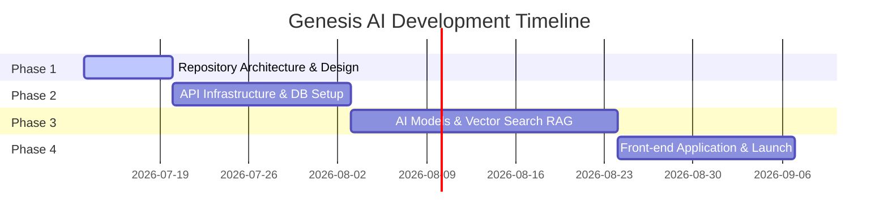

# 🗺️ Product Roadmap

This document outlines the high-level roadmap and feature release milestones for **Genesis AI**.

---

## Phases & Milestones

---

### 📍 Phase 1: Foundation (In Progress)
- [x] Monorepo workspace configuration.
- [x] Initial folder structure and documentation.
- [ ] Core styling system design tokens and utility architecture.
- [ ] Shared type definition libraries and build tools.

### 📍 Phase 2: Core Services & Database
- [ ] Docker configuration for local database and dev services.
- [ ] User authentication flow (JWT).
- [ ] API server boilerplates, routes, and error handlers.
- [ ] Setup of PostgreSQL schema tables.

### 📍 Phase 3: AI Engine Integration
- [ ] Integration with LLM Providers (OpenAI, Gemini).
- [ ] Streaming response support (Server-Sent Events).
- [ ] Vector database setup for RAG (Pinecone / PgVector).
- [ ] Prompt template and system prompt design.

### 📍 Phase 4: Frontend UI/UX
- [ ] Setup of Vite/Next.js client.
- [ ] Implementation of sleek dark/light system design.
- [ ] Realtime chat layout and stream rendering.
- [ ] User profile, session storage, and dashboard layout.
